# Operations Guide - Centralized Analytics Dashboard

## Overview

This document provides comprehensive operational procedures for the Centralized Analytics Dashboard, including deployment, monitoring, maintenance, and incident response specific to the React-based frontend application.

## Table of Contents

1. [Deployment Operations](#deployment-operations)
2. [Monitoring and Alerting](#monitoring-and-alerting)
3. [Maintenance Procedures](#maintenance-procedures)
4. [Incident Response](#incident-response)
5. [Performance Management](#performance-management)
6. [Security Operations](#security-operations)
7. [Content Delivery and Caching](#content-delivery-and-caching)
8. [User Experience Monitoring](#user-experience-monitoring)

## Deployment Operations

### Deployment Environments

| Environment | Purpose | URL | Auto-Deploy | CDN |
|-------------|---------|-----|-------------|-----|
| Development | Feature development | `https://dev-analytics.dashboard.gogidix.com` | Yes (dev branch) | Disabled |
| Staging | Pre-production testing | `https://staging-analytics.dashboard.gogidix.com` | Yes (main branch) | Enabled |
| Production | Live system | `https://analytics.dashboard.gogidix.com` | Manual approval | Enabled |

### Frontend Deployment Pipeline

```mermaid
graph LR
    A[Code Commit] --> B[Install Dependencies]
    B --> C[Type Check]
    C --> D[Lint & Format]
    D --> E[Unit Tests]
    E --> F[Build Production]
    F --> G[Bundle Analysis]
    G --> H[E2E Tests]
    H --> I[Security Scan]
    I --> J[Deploy to CDN]
    J --> K[Cache Invalidation]
    K --> L[Health Check]
```



### Deployment Commands

#### Local Build and Test

```bash
# Install dependencies
npm ci

# Type checking
npm run type-check

# Linting and formatting
npm run lint
npm run format

# Unit tests
npm run test:ci

# Build for production
npm run build

# Analyze bundle
npm run analyze

# Local production preview
npm run preview
```

#### Docker Deployment

```bash
# Build optimized production image
docker build -t centralized-analytics-dashboard:latest \
  --build-arg NODE_ENV=production \
  --build-arg REACT_APP_VERSION=$(git rev-parse --short HEAD) .

# Multi-stage build for minimal size
docker build -f Dockerfile.production \
  -t centralized-analytics-dashboard:$(git rev-parse --short HEAD) .

# Run container with health check
docker run -d \
  --name analytics-dashboard \
  -p 80:80 \
  --health-cmd="curl -f http://localhost/health || exit 1" \
  --health-interval=30s \
  --health-timeout=10s \
  --health-retries=3 \
  centralized-analytics-dashboard:latest
```

#### Kubernetes Deployment

```bash
# Deploy with specific version
kubectl set image deployment/analytics-dashboard \
  analytics-dashboard=centralized-analytics-dashboard:v1.2.3 \
  -n centralized-dashboard

# Rollback to previous version
kubectl rollout undo deployment/analytics-dashboard \
  -n centralized-dashboard

# Check rollout status
kubectl rollout status deployment/analytics-dashboard \
  -n centralized-dashboard

# Scale deployment
kubectl scale deployment/analytics-dashboard \
  --replicas=5 -n centralized-dashboard
```

#### CDN Deployment (Production)

```bash
# Build and deploy to S3/CloudFront
npm run build
aws s3 sync build/ s3://analytics-dashboard-prod --delete

# Invalidate CloudFront cache
aws cloudfront create-invalidation \
  --distribution-id E1234567890 \
  --paths "/*"

# Verify deployment
curl -I https://analytics.dashboard.gogidix.com
```

### Blue-Green Deployment

```bash
# Deploy to green environment
kubectl apply -f k8s/deployment-green.yaml

# Run smoke tests on green
./scripts/smoke-tests.sh green

# Switch traffic to green
kubectl patch service analytics-dashboard \
  -p '{"spec":{"selector":{"version":"green"}}}'

# Monitor for 10 minutes, then cleanup blue
sleep 600
kubectl delete -f k8s/deployment-blue.yaml
```

## Monitoring and Alerting

### Frontend Monitoring Stack

- **Real User Monitoring (RUM)**: Google Analytics 4, Mixpanel
- **Error Tracking**: Sentry
- **Performance**: Web Vitals, Lighthouse CI
- **Uptime**: Pingdom, UptimeRobot
- **CDN Monitoring**: CloudFront metrics

### Key Metrics

#### Core Web Vitals

| Metric | Good | Needs Improvement | Poor | Alert Threshold |
|--------|------|------------------|------|-----------------|
| **Largest Contentful Paint (LCP)** | ≤2.5s | 2.5s-4.0s | >4.0s | >3.0s |
| **First Input Delay (FID)** | ≤100ms | 100ms-300ms | >300ms | >200ms |
| **Cumulative Layout Shift (CLS)** | ≤0.1 | 0.1-0.25 | >0.25 | >0.2 |

#### Application Metrics

| Metric | Threshold | Alert Level |
|--------|-----------|-------------|
| JavaScript Error Rate | >1% | Warning |
| API Error Rate | >5% | Critical |
| Page Load Time (P95) | >5s | Warning |
| Bundle Size | >2MB | Warning |
| WebSocket Connection Success | <95% | Warning |

#### Business Metrics

| Metric | Threshold | Alert Level |
|--------|-----------|-------------|
| Daily Active Users | 20% drop | Warning |
| Dashboard Views | 30% drop | Critical |
| Feature Usage | 50% drop | Warning |
| User Session Duration | 40% drop | Warning |

### Monitoring Configuration

#### Sentry Error Tracking

```javascript
// sentry.config.js
import * as Sentry from '@sentry/react';
import { BrowserTracing } from '@sentry/tracing';

Sentry.init({
  dsn: process.env.REACT_APP_SENTRY_DSN,
  environment: process.env.NODE_ENV,
  integrations: [
    new BrowserTracing({
      tracingOrigins: [
        process.env.REACT_APP_API_BASE_URL,
        /^https:\/\/analytics\.dashboard\.gogidix\.com\/api/
      ]
    })
  ],
  tracesSampleRate: 0.1,
  beforeSend(event) {
    // Filter out known issues
    if (event.exception) {
      const error = event.exception.values[0];
      if (error.value && error.value.includes('Non-Error promise rejection')) {
        return null;
      }
    }
    return event;
  }
});
```

#### Web Vitals Monitoring

```javascript
// webVitals.js
import { getCLS, getFID, getFCP, getLCP, getTTFB } from 'web-vitals';

function sendToAnalytics(metric) {
  // Send to multiple analytics services
  gtag('event', metric.name, {
    event_category: 'Web Vitals',
    value: Math.round(metric.value),
    event_label: metric.id,
    non_interaction: true,
  });
  
  // Send to custom analytics
  fetch('/api/v1/analytics/vitals', {
    method: 'POST',
    body: JSON.stringify(metric),
    headers: { 'Content-Type': 'application/json' }
  });
}

getCLS(sendToAnalytics);
getFID(sendToAnalytics);
getFCP(sendToAnalytics);
getLCP(sendToAnalytics);
getTTFB(sendToAnalytics);
```

### Alert Configuration

#### Prometheus Alerts for Frontend

```yaml
groups:
- name: analytics-dashboard.rules
  rules:
  - alert: HighJavaScriptErrorRate
    expr: rate(javascript_errors_total[5m]) > 0.01
    for: 2m
    labels:
      severity: warning
    annotations:
      summary: "High JavaScript error rate in analytics dashboard"
      description: "JavaScript error rate is {{ $value }} errors/second"

  - alert: SlowPageLoadTime
    expr: histogram_quantile(0.95, rate(page_load_duration_seconds_bucket[5m])) > 5
    for: 5m
    labels:
      severity: warning
    annotations:
      summary: "Slow page load times in analytics dashboard"
      description: "95th percentile page load time is {{ $value }}s"

  - alert: CDNHighErrorRate
    expr: rate(cdn_errors_total[5m]) > 0.05
    for: 2m
    labels:
      severity: critical
    annotations:
      summary: "High CDN error rate"
      description: "CDN error rate is {{ $value }} errors/second"
```

## Maintenance Procedures

### Regular Maintenance Tasks

#### Daily Tasks

```bash
# Check application health
./scripts/health-check.sh

# Review error logs
./scripts/check-frontend-errors.sh

# Monitor performance metrics
./scripts/performance-report.sh

# Verify CDN cache hit ratio
./scripts/cdn-metrics.sh
```

#### Weekly Tasks

```bash
# Update dependencies
npm audit
npm update

# Bundle size analysis
npm run analyze
./scripts/bundle-size-report.sh

# Security vulnerability scan
npm audit --audit-level high
./scripts/security-scan.sh

# Performance audit
lighthouse --chrome-flags="--headless" \
  https://analytics.dashboard.gogidix.com \
  --output html --output-path ./reports/lighthouse.html
```

#### Monthly Tasks

```bash
# Comprehensive dependency update
npx npm-check-updates -u
npm install
npm test

# Clean up old Docker images
docker image prune -f
docker system prune -f

# CDN cost analysis
./scripts/cdn-cost-analysis.sh

# User journey analysis
./scripts/user-journey-report.sh
```

### Frontend-Specific Maintenance

#### Bundle Optimization

```bash
# Analyze bundle composition
npm run analyze

# Check for duplicate dependencies
npx webpack-bundle-analyzer build/static/js/*.js

# Tree-shaking analysis
npm run build -- --analyze
```

#### Cache Management

```bash
# Clear browser cache headers
./scripts/update-cache-headers.sh

# Invalidate CDN cache
aws cloudfront create-invalidation \
  --distribution-id E1234567890 \
  --paths "/static/js/*" "/static/css/*"

# Update service worker cache
./scripts/update-sw-cache.sh
```

#### Performance Optimization

```javascript
// webpack-bundle-analyzer report
const BundleAnalyzerPlugin = require('webpack-bundle-analyzer').BundleAnalyzerPlugin;

module.exports = {
  plugins: [
    new BundleAnalyzerPlugin({
      analyzerMode: 'static',
      openAnalyzer: false,
      reportFilename: 'bundle-report.html'
    })
  ]
};
```

## Incident Response

### Frontend-Specific Incident Types

| Incident Type | Severity | Response Time | Escalation |
|---------------|----------|---------------|------------|
| **Site Down** | P1 | 5 minutes | Immediate |
| **JavaScript Errors** | P2 | 15 minutes | 30 minutes |
| **Slow Load Times** | P2 | 30 minutes | 1 hour |
| **Feature Broken** | P3 | 1 hour | 2 hours |
| **UI/UX Issues** | P4 | 4 hours | 8 hours |

### Incident Response Runbooks

#### Site Down / 5xx Errors

```bash
# Step 1: Check CDN status
curl -I https://analytics.dashboard.gogidix.com
aws cloudfront get-distribution --id E1234567890

# Step 2: Check origin server
kubectl get pods -n centralized-dashboard
kubectl logs deployment/analytics-dashboard -n centralized-dashboard

# Step 3: Check recent deployments
kubectl rollout history deployment/analytics-dashboard -n centralized-dashboard

# Step 4: Rollback if needed
kubectl rollout undo deployment/analytics-dashboard -n centralized-dashboard

# Step 5: Verify recovery
./scripts/smoke-tests.sh production
```

#### High JavaScript Error Rate

```bash
# Step 1: Check Sentry for error details
./scripts/sentry-error-analysis.sh

# Step 2: Identify affected browsers/versions
./scripts/browser-error-analysis.sh

# Step 3: Check recent code changes
git log --oneline --since="24 hours ago"

# Step 4: Deploy hotfix if critical
./scripts/hotfix-deploy.sh

# Step 5: Monitor error rate
./scripts/monitor-error-rate.sh
```

#### Performance Degradation

```bash
# Step 1: Run Lighthouse audit
lighthouse --chrome-flags="--headless" \
  https://analytics.dashboard.gogidix.com \
  --output json --output-path /tmp/lighthouse.json

# Step 2: Check bundle size
npm run analyze

# Step 3: Verify CDN performance
./scripts/cdn-performance-check.sh

# Step 4: Check API response times
./scripts/api-performance-check.sh

# Step 5: Optimize if needed
./scripts/performance-optimization.sh
```

## Performance Management

### Frontend Performance Optimization

#### Code Splitting and Lazy Loading

```javascript
// Route-based code splitting
import { lazy, Suspense } from 'react';

const Dashboard = lazy(() => import('./pages/Dashboard'));
const Analytics = lazy(() => import('./pages/Analytics'));

function App() {
  return (
    <Suspense fallback={<div>Loading...</div>}>
      <Routes>
        <Route path="/dashboard" element={<Dashboard />} />
        <Route path="/analytics" element={<Analytics />} />
      </Routes>
    </Suspense>
  );
}
```

#### Performance Monitoring

```javascript
// Performance monitoring hook
import { useEffect } from 'react';

export function usePerformanceMonitoring(componentName) {
  useEffect(() => {
    const startTime = performance.now();
    
    return () => {
      const endTime = performance.now();
      const renderTime = endTime - startTime;
      
      // Send metrics to analytics
      gtag('event', 'component_render_time', {
        event_category: 'Performance',
        event_label: componentName,
        value: Math.round(renderTime)
      });
    };
  }, [componentName]);
}
```

#### Bundle Size Optimization

```bash
# Analyze bundle size trends
./scripts/bundle-size-trends.sh

# Tree-shaking optimization
npm run build -- --analyze

# Check for unused code
npx unimported
npx depcheck
```

### CDN and Caching Strategy

#### Cache Headers Configuration

```nginx
# Nginx cache configuration
location ~* \.(js|css)$ {
    expires 1y;
    add_header Cache-Control "public, immutable";
    add_header Vary "Accept-Encoding";
}

location ~* \.(png|jpg|jpeg|gif|ico|svg)$ {
    expires 6M;
    add_header Cache-Control "public";
}

location / {
    expires -1;
    add_header Cache-Control "no-cache, no-store, must-revalidate";
}
```

#### Service Worker Caching

```javascript
// Service worker cache strategy
const CACHE_NAME = 'analytics-dashboard-v1.2.3';
const urlsToCache = [
  '/',
  '/static/js/main.js',
  '/static/css/main.css',
  '/api/v1/config'
];

self.addEventListener('install', (event) => {
  event.waitUntil(
    caches.open(CACHE_NAME)
      .then((cache) => cache.addAll(urlsToCache))
  );
});
```

## Security Operations

### Frontend Security Measures

#### Content Security Policy

```html
<!-- CSP headers -->
<meta http-equiv="Content-Security-Policy" 
      content="default-src 'self'; 
               script-src 'self' 'unsafe-inline' https://www.google-analytics.com;
               style-src 'self' 'unsafe-inline';
               img-src 'self' data: https:;
               connect-src 'self' wss: https:;
               font-src 'self';
               frame-ancestors 'none';">
```

#### Security Headers

```nginx
# Security headers in Nginx
add_header X-Frame-Options "DENY" always;
add_header X-Content-Type-Options "nosniff" always;
add_header X-XSS-Protection "1; mode=block" always;
add_header Referrer-Policy "strict-origin-when-cross-origin" always;
add_header Permissions-Policy "geolocation=(), microphone=(), camera=()" always;
```

#### Dependency Security

```bash
# Security audit
npm audit --audit-level high

# Check for known vulnerabilities
npx better-npm-audit audit

# Update vulnerable packages
npm audit fix

# Snyk security scanning
npx snyk test
npx snyk monitor
```

### Security Monitoring

```bash
# Daily security checks
./scripts/security-scan.sh

# Check for malicious scripts
./scripts/script-integrity-check.sh

# Monitor CSP violations
./scripts/csp-violation-report.sh

# SSL certificate monitoring
./scripts/ssl-cert-check.sh
```

## Content Delivery and Caching

### CDN Configuration

#### CloudFront Distribution

```json
{
  "Origins": [
    {
      "Id": "analytics-dashboard-origin",
      "DomainName": "analytics-dashboard-origin.s3.amazonaws.com",
      "S3OriginConfig": {
        "OriginAccessIdentity": "origin-access-identity/cloudfront/E123456789"
      }
    }
  ],
  "DefaultCacheBehavior": {
    "TargetOriginId": "analytics-dashboard-origin",
    "ViewerProtocolPolicy": "redirect-to-https",
    "CachePolicyId": "4135ea2d-6df8-44a3-9df3-4b5a84be39ad",
    "Compress": true
  },
  "CacheBehaviors": [
    {
      "PathPattern": "/static/*",
      "TargetOriginId": "analytics-dashboard-origin",
      "ViewerProtocolPolicy": "redirect-to-https",
      "CachePolicyId": "cache-optimized"
    }
  ]
}
```

#### Cache Invalidation Strategy

```bash
# Selective cache invalidation
aws cloudfront create-invalidation \
  --distribution-id E1234567890 \
  --paths "/index.html" "/_next/static/*"

# Monitor cache hit ratio
aws cloudwatch get-metric-statistics \
  --namespace AWS/CloudFront \
  --metric-name CacheHitRate \
  --dimensions Name=DistributionId,Value=E1234567890 \
  --start-time 2023-01-01T00:00:00Z \
  --end-time 2023-01-02T00:00:00Z \
  --period 3600 \
  --statistics Average
```

## User Experience Monitoring

### Real User Monitoring (RUM)

```javascript
// Custom RUM implementation
class RUMCollector {
  constructor() {
    this.metrics = {};
    this.startTime = Date.now();
  }
  
  trackPageView(page) {
    gtag('config', 'GA_MEASUREMENT_ID', {
      page_title: page,
      page_location: window.location.href
    });
  }
  
  trackUserInteraction(element, action) {
    gtag('event', action, {
      event_category: 'User Interaction',
      event_label: element
    });
  }
  
  trackError(error) {
    gtag('event', 'exception', {
      description: error.message,
      fatal: false
    });
  }
}
```

### A/B Testing

```javascript
// Feature flag integration
import { useFeatureFlag } from './hooks/useFeatureFlag';

function DashboardComponent() {
  const newChartDesign = useFeatureFlag('new-chart-design');
  
  return (
    <div>
      {newChartDesign ? 
        <NewChartComponent /> : 
        <LegacyChartComponent />
      }
    </div>
  );
}
```

## Emergency Contacts

| Role | Name | Phone | Email | Escalation |
|------|------|-------|-------|------------|
| Frontend Lead | [NAME] | [PHONE] | frontend@gogidix.com | Primary |
| DevOps Engineer | [NAME] | [PHONE] | devops@gogidix.com | Infrastructure |
| UX Team Lead | [NAME] | [PHONE] | ux@gogidix.com | User Experience |
| Security Team | [NAME] | [PHONE] | security@gogidix.com | Security Issues |

## Documentation Updates

This document should be reviewed and updated:
- After each major release
- When new monitoring tools are added
- After significant incidents
- During quarterly reviews

**Last Updated**: 2024-01-20  
**Next Review**: 2024-04-20